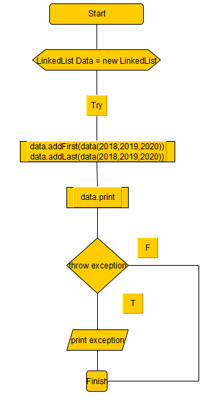
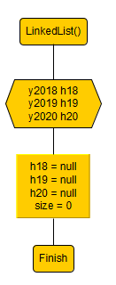
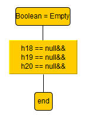
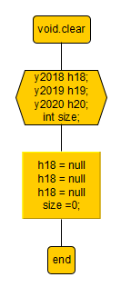
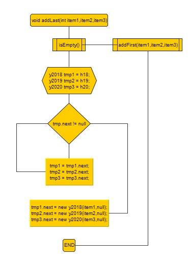
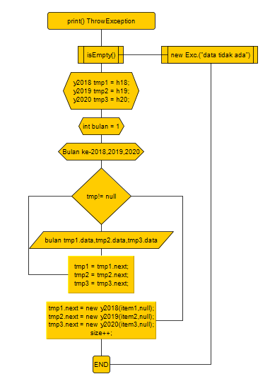

# Penjelasan Kuis 2

Nama  : Risang Daniswara
Kelas : TI-1F
Absen : 25

# Screen Shoot tiap kelas :
1. Class Kuis 2.png

2. Class LinkedList.png

3. Class y2018.png

4. Class y2019.png

5. Class y2020.png

# Flowchart :
1. MainLinkedList

2. LinkedListF

3. isEmpty

4. isClear

5. addLast

6. AddFirst

7. Print

# Penjelasan

Pada kode program terdapat 5 class, yaitu class main, linkedList, dan class untuk menyimpan node per tahun. Pada class main diinputkan data secara statis sesuai data yang diberikan:

   1.  gunakan method addFirst untuk mengisi data pertama, pada LinkedLists data pertama sehingga data yang baru langsung dimasukkan ke head.
    
   2.  masukkan data selanjutnya dengan menggunakan method addLast dengan memasukkan data ke node next lalu dilakukan pengecekan, apabila linkedlist sedang kosong, maka dipanggil method addFirst, jika tidak semua data melakukan perulangan traverse.
    
   3.  print data terus berulang seperti itu hingga variabel bernilai null atau tidak ada data lagi yang bisa ditampilkan.
